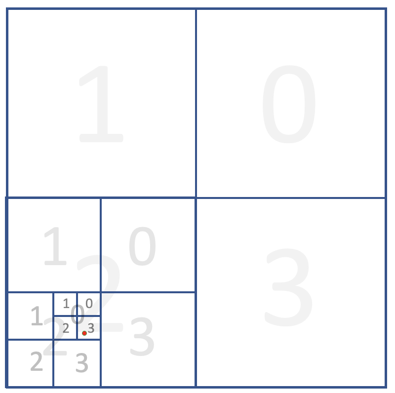

# Quadgrid
The `quadgrid` package provides a class and some convenience functions 
for generating quadtree-based grids at arbitrary resolutions in pandas, geopandas and xarray formats for use in geospatial analysis and catastrophe risk modelling. 

## Overview
Quadtree grids are a way of recursively partitioning a plane into
nested quadrants, allowing for simple but efficient geocoding of
points.

Some assumptions have been made to simplify the package:
- all coordinates are in decimal degrees
- all longitudes range from -180 to +180 degrees
- the centre of the grid is at 0E, 0N

The package contains a single class, `QuadGrid`, which is used to
generate grid objects. The class has methods to convert the grid into
tabular (pandas DataFrame), vector (geopandas GeoDataFrame) and raster
(xarray Dataset) formats which can be saved or used in further processing.

Individual quadcells at a given resolution are labelled with unique
quadtreeIDs (qids). In the simplified example below, the red point is in top-level cell '2', then cell '2', then '0' then '3' giving a nominal qid of '2203'. In practice, quadtrees lend themselves to a base-4 encoding, allowing them to be stored and processed efficiently as integers.

## Versions
`0.1.4` Fixed bug in quadgrids defined at a resolution coarser than 1 degree
`0.1.3` Added resolution to DataFrame conversions; apply_mask can accept GeoDataFrames
`0.1.2` Changed email address in pyproject.toml
`0.1.1` Bug fix to ensure user-specified bounded grid is consistent with the global grid
`0.1.0` First release

