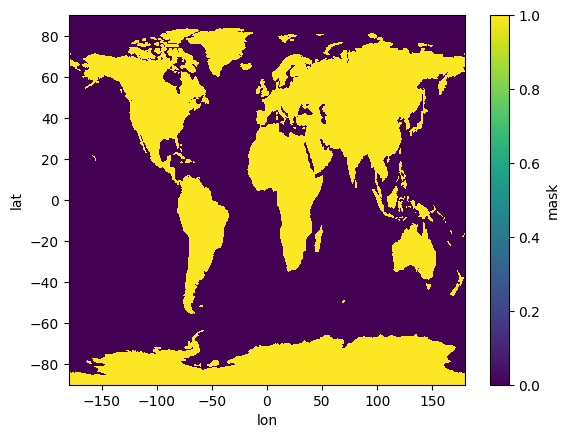
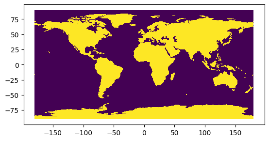
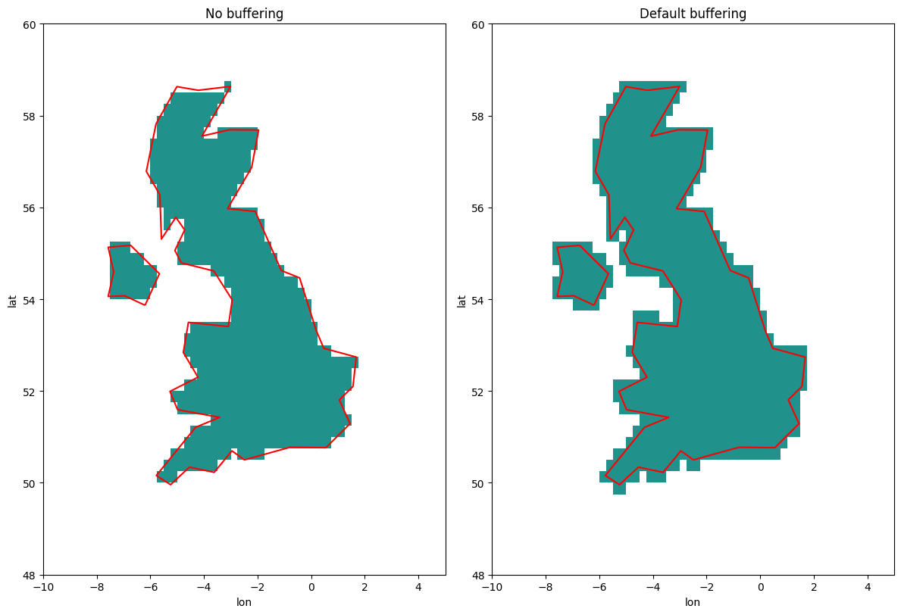
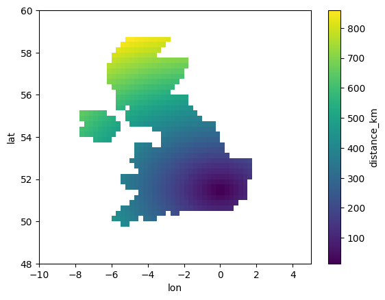

# Quadgrid
The `quadgrid` package provides a class and some convenience functions 
for generating quadtree-based grids at arbitrary resolutions in pandas, geopandas and xarray formats for use in geospatial analysis and catastrophe risk modelling. 

## Overview
Quadtree grids are a way of recursively partitioning a plane into
nested quadrants, allowing for simple but efficient geocoding of
points.

Some assumptions have been made to simplify the package:
- all coordinates are in decimal degrees
- all longitudes range from -180 to +180 degrees
- the centre of the grid is at 0E, 0N

The package contains a single class, `QuadGrid`, which is used to
generate grid objects. The class has methods to convert the grid into
tabular (pandas DataFrame), vector (geopandas GeoDataFrame) and raster
(xarray Dataset) formats which can be saved or used in further processing.

Individual quadcells at a given resolution are labelled with unique
quadtreeIDs (qids). In the simplified example below, the red point is in top-level cell '2', then cell '2', then '0' then '3' giving a nominal qid of '2203'. In practice, quadtrees lend themselves to a base-4 encoding, allowing them to be stored and processed efficiently as integers.


## Versions
`0.1.0` First release

## Examples


```python
import quadgrid as qg
import matplotlib.pyplot as plt
import geopandas as gpd
```

Load low resolution Natural Earth shapefiles from geopandas for demonstrations.


```python
world = gpd.read_file(gpd.datasets.get_path('naturalearth_lowres'))
world_geom = world.dissolve().loc[0,'geometry']
uk_geom = world.set_index('iso_a3').loc['GBR','geometry']
```

    /var/folders/_c/rp75w5gn0350fmjtsw645xqc0000gs/T/ipykernel_38026/2235393568.py:1: FutureWarning: The geopandas.dataset module is deprecated and will be removed in GeoPandas 1.0. You can get the original 'naturalearth_lowres' data from https://www.naturalearthdata.com/downloads/110m-cultural-vectors/.
      world = gpd.read_file(gpd.datasets.get_path('naturalearth_lowres'))


### Global low-resolution grid

Create global quadgrid at 1.0$^{\circ}$ resolution:


```python
q100_world = qg.QuadGrid(0.25)
q100_world
```


    QuadGrid (0.25) -180<=lon<=180 | -90<=lat<=90


Apply a shapely geometry object (either a Polygon or MultiPolygon) as a mask, in this case the dissolved country shapefile:


```python
q100_world.apply_mask(world_geom)
```


```python
q100_world_pd = q100_world.to_pandas()
q100_world_pd
```


<div>
<style scoped>
    .dataframe tbody tr th:only-of-type {
        vertical-align: middle;
    }

    .dataframe tbody tr th {
        vertical-align: top;
    }

    .dataframe thead th {
        text-align: right;
    }
</style>
<table border="1" class="dataframe">
  <thead>
    <tr style="text-align: right;">
      <th></th>
      <th></th>
      <th>qid</th>
      <th>area</th>
      <th>mask</th>
    </tr>
    <tr>
      <th>lat</th>
      <th>lon</th>
      <th></th>
      <th></th>
      <th></th>
    </tr>
  </thead>
  <tbody>
    <tr>
      <th rowspan="5" valign="top">-89.875</th>
      <th>-179.875</th>
      <td>2583658</td>
      <td>1.685923</td>
      <td>True</td>
    </tr>
    <tr>
      <th>-179.625</th>
      <td>2583659</td>
      <td>1.685923</td>
      <td>True</td>
    </tr>
    <tr>
      <th>-179.375</th>
      <td>2583662</td>
      <td>1.685923</td>
      <td>True</td>
    </tr>
    <tr>
      <th>-179.125</th>
      <td>2583663</td>
      <td>1.685923</td>
      <td>True</td>
    </tr>
    <tr>
      <th>-178.875</th>
      <td>2583674</td>
      <td>1.685923</td>
      <td>True</td>
    </tr>
    <tr>
      <th>...</th>
      <th>...</th>
      <td>...</td>
      <td>...</td>
      <td>...</td>
    </tr>
    <tr>
      <th rowspan="5" valign="top">89.875</th>
      <th>178.875</th>
      <td>902864</td>
      <td>1.685923</td>
      <td>False</td>
    </tr>
    <tr>
      <th>179.125</th>
      <td>902853</td>
      <td>1.685923</td>
      <td>False</td>
    </tr>
    <tr>
      <th>179.375</th>
      <td>902852</td>
      <td>1.685923</td>
      <td>False</td>
    </tr>
    <tr>
      <th>179.625</th>
      <td>902849</td>
      <td>1.685923</td>
      <td>False</td>
    </tr>
    <tr>
      <th>179.875</th>
      <td>902848</td>
      <td>1.685923</td>
      <td>False</td>
    </tr>
  </tbody>
</table>
<p>1036800 rows × 3 columns</p>
</div>


```python
q100_world_xr = q100_world.to_xarray()
q100_world_xr
```


<div><svg style="position: absolute; width: 0; height: 0; overflow: hidden">
<defs>
<symbol id="icon-database" viewBox="0 0 32 32">
<path d="M16 0c-8.837 0-16 2.239-16 5v4c0 2.761 7.163 5 16 5s16-2.239 16-5v-4c0-2.761-7.163-5-16-5z"></path>
<path d="M16 17c-8.837 0-16-2.239-16-5v6c0 2.761 7.163 5 16 5s16-2.239 16-5v-6c0 2.761-7.163 5-16 5z"></path>
<path d="M16 26c-8.837 0-16-2.239-16-5v6c0 2.761 7.163 5 16 5s16-2.239 16-5v-6c0 2.761-7.163 5-16 5z"></path>
</symbol>
<symbol id="icon-file-text2" viewBox="0 0 32 32">
<path d="M28.681 7.159c-0.694-0.947-1.662-2.053-2.724-3.116s-2.169-2.030-3.116-2.724c-1.612-1.182-2.393-1.319-2.841-1.319h-15.5c-1.378 0-2.5 1.121-2.5 2.5v27c0 1.378 1.122 2.5 2.5 2.5h23c1.378 0 2.5-1.122 2.5-2.5v-19.5c0-0.448-0.137-1.23-1.319-2.841zM24.543 5.457c0.959 0.959 1.712 1.825 2.268 2.543h-4.811v-4.811c0.718 0.556 1.584 1.309 2.543 2.268zM28 29.5c0 0.271-0.229 0.5-0.5 0.5h-23c-0.271 0-0.5-0.229-0.5-0.5v-27c0-0.271 0.229-0.5 0.5-0.5 0 0 15.499-0 15.5 0v7c0 0.552 0.448 1 1 1h7v19.5z"></path>
<path d="M23 26h-14c-0.552 0-1-0.448-1-1s0.448-1 1-1h14c0.552 0 1 0.448 1 1s-0.448 1-1 1z"></path>
<path d="M23 22h-14c-0.552 0-1-0.448-1-1s0.448-1 1-1h14c0.552 0 1 0.448 1 1s-0.448 1-1 1z"></path>
<path d="M23 18h-14c-0.552 0-1-0.448-1-1s0.448-1 1-1h14c0.552 0 1 0.448 1 1s-0.448 1-1 1z"></path>
</symbol>
</defs>
</svg>
<style>/* CSS stylesheet for displaying xarray objects in jupyterlab.
 *
 */

:root {
  --xr-font-color0: var(--jp-content-font-color0, rgba(0, 0, 0, 1));
  --xr-font-color2: var(--jp-content-font-color2, rgba(0, 0, 0, 0.54));
  --xr-font-color3: var(--jp-content-font-color3, rgba(0, 0, 0, 0.38));
  --xr-border-color: var(--jp-border-color2, #e0e0e0);
  --xr-disabled-color: var(--jp-layout-color3, #bdbdbd);
  --xr-background-color: var(--jp-layout-color0, white);
  --xr-background-color-row-even: var(--jp-layout-color1, white);
  --xr-background-color-row-odd: var(--jp-layout-color2, #eeeeee);
}

html[theme=dark],
body[data-theme=dark],
body.vscode-dark {
  --xr-font-color0: rgba(255, 255, 255, 1);
  --xr-font-color2: rgba(255, 255, 255, 0.54);
  --xr-font-color3: rgba(255, 255, 255, 0.38);
  --xr-border-color: #1F1F1F;
  --xr-disabled-color: #515151;
  --xr-background-color: #111111;
  --xr-background-color-row-even: #111111;
  --xr-background-color-row-odd: #313131;
}

.xr-wrap {
  display: block !important;
  min-width: 300px;
  max-width: 700px;
}

.xr-text-repr-fallback {
  /* fallback to plain text repr when CSS is not injected (untrusted notebook) */
  display: none;
}

.xr-header {
  padding-top: 6px;
  padding-bottom: 6px;
  margin-bottom: 4px;
  border-bottom: solid 1px var(--xr-border-color);
}

.xr-header > div,
.xr-header > ul {
  display: inline;
  margin-top: 0;
  margin-bottom: 0;
}

.xr-obj-type,
.xr-array-name {
  margin-left: 2px;
  margin-right: 10px;
}

.xr-obj-type {
  color: var(--xr-font-color2);
}

.xr-sections {
  padding-left: 0 !important;
  display: grid;
  grid-template-columns: 150px auto auto 1fr 20px 20px;
}

.xr-section-item {
  display: contents;
}

.xr-section-item input {
  display: none;
}

.xr-section-item input + label {
  color: var(--xr-disabled-color);
}

.xr-section-item input:enabled + label {
  cursor: pointer;
  color: var(--xr-font-color2);
}

.xr-section-item input:enabled + label:hover {
  color: var(--xr-font-color0);
}

.xr-section-summary {
  grid-column: 1;
  color: var(--xr-font-color2);
  font-weight: 500;
}

.xr-section-summary > span {
  display: inline-block;
  padding-left: 0.5em;
}

.xr-section-summary-in:disabled + label {
  color: var(--xr-font-color2);
}

.xr-section-summary-in + label:before {
  display: inline-block;
  content: '►';
  font-size: 11px;
  width: 15px;
  text-align: center;
}

.xr-section-summary-in:disabled + label:before {
  color: var(--xr-disabled-color);
}

.xr-section-summary-in:checked + label:before {
  content: '▼';
}

.xr-section-summary-in:checked + label > span {
  display: none;
}

.xr-section-summary,
.xr-section-inline-details {
  padding-top: 4px;
  padding-bottom: 4px;
}

.xr-section-inline-details {
  grid-column: 2 / -1;
}

.xr-section-details {
  display: none;
  grid-column: 1 / -1;
  margin-bottom: 5px;
}

.xr-section-summary-in:checked ~ .xr-section-details {
  display: contents;
}

.xr-array-wrap {
  grid-column: 1 / -1;
  display: grid;
  grid-template-columns: 20px auto;
}

.xr-array-wrap > label {
  grid-column: 1;
  vertical-align: top;
}

.xr-preview {
  color: var(--xr-font-color3);
}

.xr-array-preview,
.xr-array-data {
  padding: 0 5px !important;
  grid-column: 2;
}

.xr-array-data,
.xr-array-in:checked ~ .xr-array-preview {
  display: none;
}

.xr-array-in:checked ~ .xr-array-data,
.xr-array-preview {
  display: inline-block;
}

.xr-dim-list {
  display: inline-block !important;
  list-style: none;
  padding: 0 !important;
  margin: 0;
}

.xr-dim-list li {
  display: inline-block;
  padding: 0;
  margin: 0;
}

.xr-dim-list:before {
  content: '(';
}

.xr-dim-list:after {
  content: ')';
}

.xr-dim-list li:not(:last-child):after {
  content: ',';
  padding-right: 5px;
}

.xr-has-index {
  font-weight: bold;
}

.xr-var-list,
.xr-var-item {
  display: contents;
}

.xr-var-item > div,
.xr-var-item label,
.xr-var-item > .xr-var-name span {
  background-color: var(--xr-background-color-row-even);
  margin-bottom: 0;
}

.xr-var-item > .xr-var-name:hover span {
  padding-right: 5px;
}

.xr-var-list > li:nth-child(odd) > div,
.xr-var-list > li:nth-child(odd) > label,
.xr-var-list > li:nth-child(odd) > .xr-var-name span {
  background-color: var(--xr-background-color-row-odd);
}

.xr-var-name {
  grid-column: 1;
}

.xr-var-dims {
  grid-column: 2;
}

.xr-var-dtype {
  grid-column: 3;
  text-align: right;
  color: var(--xr-font-color2);
}

.xr-var-preview {
  grid-column: 4;
}

.xr-index-preview {
  grid-column: 2 / 5;
  color: var(--xr-font-color2);
}

.xr-var-name,
.xr-var-dims,
.xr-var-dtype,
.xr-preview,
.xr-attrs dt {
  white-space: nowrap;
  overflow: hidden;
  text-overflow: ellipsis;
  padding-right: 10px;
}

.xr-var-name:hover,
.xr-var-dims:hover,
.xr-var-dtype:hover,
.xr-attrs dt:hover {
  overflow: visible;
  width: auto;
  z-index: 1;
}

.xr-var-attrs,
.xr-var-data,
.xr-index-data {
  display: none;
  background-color: var(--xr-background-color) !important;
  padding-bottom: 5px !important;
}

.xr-var-attrs-in:checked ~ .xr-var-attrs,
.xr-var-data-in:checked ~ .xr-var-data,
.xr-index-data-in:checked ~ .xr-index-data {
  display: block;
}

.xr-var-data > table {
  float: right;
}

.xr-var-name span,
.xr-var-data,
.xr-index-name div,
.xr-index-data,
.xr-attrs {
  padding-left: 25px !important;
}

.xr-attrs,
.xr-var-attrs,
.xr-var-data,
.xr-index-data {
  grid-column: 1 / -1;
}

dl.xr-attrs {
  padding: 0;
  margin: 0;
  display: grid;
  grid-template-columns: 125px auto;
}

.xr-attrs dt,
.xr-attrs dd {
  padding: 0;
  margin: 0;
  float: left;
  padding-right: 10px;
  width: auto;
}

.xr-attrs dt {
  font-weight: normal;
  grid-column: 1;
}

.xr-attrs dt:hover span {
  display: inline-block;
  background: var(--xr-background-color);
  padding-right: 10px;
}

.xr-attrs dd {
  grid-column: 2;
  white-space: pre-wrap;
  word-break: break-all;
}

.xr-icon-database,
.xr-icon-file-text2,
.xr-no-icon {
  display: inline-block;
  vertical-align: middle;
  width: 1em;
  height: 1.5em !important;
  stroke-width: 0;
  stroke: currentColor;
  fill: currentColor;
}
</style><pre class='xr-text-repr-fallback'>&lt;xarray.Dataset&gt;
Dimensions:  (lat: 720, lon: 1440)
Coordinates:
  * lat      (lat) float64 -89.88 -89.62 -89.38 -89.12 ... 89.38 89.62 89.88
  * lon      (lon) float64 -179.9 -179.6 -179.4 -179.1 ... 179.4 179.6 179.9
Data variables:
    qid      (lat, lon) int64 2583658 2583659 2583662 ... 902852 902849 902848
    area     (lat, lon) float64 1.686 1.686 1.686 1.686 ... 1.686 1.686 1.686
    mask     (lat, lon) bool True True True True ... False False False False
Attributes:
    Type:        quadgrid
    Resolution:  0.25
    Area units:  km2</pre><div class='xr-wrap' style='display:none'><div class='xr-header'><div class='xr-obj-type'>xarray.Dataset</div></div><ul class='xr-sections'><li class='xr-section-item'><input id='section-19686a2d-91c0-4503-9141-1de58fd4164c' class='xr-section-summary-in' type='checkbox' disabled ><label for='section-19686a2d-91c0-4503-9141-1de58fd4164c' class='xr-section-summary'  title='Expand/collapse section'>Dimensions:</label><div class='xr-section-inline-details'><ul class='xr-dim-list'><li><span class='xr-has-index'>lat</span>: 720</li><li><span class='xr-has-index'>lon</span>: 1440</li></ul></div><div class='xr-section-details'></div></li><li class='xr-section-item'><input id='section-1b98051a-d572-4ca2-8e91-c914f10ab762' class='xr-section-summary-in' type='checkbox'  checked><label for='section-1b98051a-d572-4ca2-8e91-c914f10ab762' class='xr-section-summary' >Coordinates: <span>(2)</span></label><div class='xr-section-inline-details'></div><div class='xr-section-details'><ul class='xr-var-list'><li class='xr-var-item'><div class='xr-var-name'><span class='xr-has-index'>lat</span></div><div class='xr-var-dims'>(lat)</div><div class='xr-var-dtype'>float64</div><div class='xr-var-preview xr-preview'>-89.88 -89.62 ... 89.62 89.88</div><input id='attrs-45627f63-b623-47e4-8c14-9e08d15d3738' class='xr-var-attrs-in' type='checkbox' disabled><label for='attrs-45627f63-b623-47e4-8c14-9e08d15d3738' title='Show/Hide attributes'><svg class='icon xr-icon-file-text2'><use xlink:href='#icon-file-text2'></use></svg></label><input id='data-2a912bdd-3bb4-4a55-b878-34b8c2a4add9' class='xr-var-data-in' type='checkbox'><label for='data-2a912bdd-3bb4-4a55-b878-34b8c2a4add9' title='Show/Hide data repr'><svg class='icon xr-icon-database'><use xlink:href='#icon-database'></use></svg></label><div class='xr-var-attrs'><dl class='xr-attrs'></dl></div><div class='xr-var-data'><pre>array([-89.875, -89.625, -89.375, ...,  89.375,  89.625,  89.875])</pre></div></li><li class='xr-var-item'><div class='xr-var-name'><span class='xr-has-index'>lon</span></div><div class='xr-var-dims'>(lon)</div><div class='xr-var-dtype'>float64</div><div class='xr-var-preview xr-preview'>-179.9 -179.6 ... 179.6 179.9</div><input id='attrs-adcd2f91-11c3-480b-b37a-8480e793b294' class='xr-var-attrs-in' type='checkbox' disabled><label for='attrs-adcd2f91-11c3-480b-b37a-8480e793b294' title='Show/Hide attributes'><svg class='icon xr-icon-file-text2'><use xlink:href='#icon-file-text2'></use></svg></label><input id='data-75827451-3e7b-4456-aab7-73472af4a1ca' class='xr-var-data-in' type='checkbox'><label for='data-75827451-3e7b-4456-aab7-73472af4a1ca' title='Show/Hide data repr'><svg class='icon xr-icon-database'><use xlink:href='#icon-database'></use></svg></label><div class='xr-var-attrs'><dl class='xr-attrs'></dl></div><div class='xr-var-data'><pre>array([-179.875, -179.625, -179.375, ...,  179.375,  179.625,  179.875])</pre></div></li></ul></div></li><li class='xr-section-item'><input id='section-a45c891b-9ef1-40c8-b7c7-76c653336367' class='xr-section-summary-in' type='checkbox'  checked><label for='section-a45c891b-9ef1-40c8-b7c7-76c653336367' class='xr-section-summary' >Data variables: <span>(3)</span></label><div class='xr-section-inline-details'></div><div class='xr-section-details'><ul class='xr-var-list'><li class='xr-var-item'><div class='xr-var-name'><span>qid</span></div><div class='xr-var-dims'>(lat, lon)</div><div class='xr-var-dtype'>int64</div><div class='xr-var-preview xr-preview'>2583658 2583659 ... 902849 902848</div><input id='attrs-e9b5c0fb-3bdf-4d33-afe0-30ae69bd4b68' class='xr-var-attrs-in' type='checkbox' disabled><label for='attrs-e9b5c0fb-3bdf-4d33-afe0-30ae69bd4b68' title='Show/Hide attributes'><svg class='icon xr-icon-file-text2'><use xlink:href='#icon-file-text2'></use></svg></label><input id='data-76529067-838d-4421-93ad-8cb87692354d' class='xr-var-data-in' type='checkbox'><label for='data-76529067-838d-4421-93ad-8cb87692354d' title='Show/Hide data repr'><svg class='icon xr-icon-database'><use xlink:href='#icon-database'></use></svg></label><div class='xr-var-attrs'><dl class='xr-attrs'></dl></div><div class='xr-var-data'><pre>array([[2583658, 2583659, 2583662, ..., 3291451, 3291454, 3291455],
       [2583657, 2583656, 2583661, ..., 3291448, 3291453, 3291452],
       [2583654, 2583655, 2583650, ..., 3291447, 3291442, 3291443],
       ...,
       [1610649, 1610648, 1610653, ...,  902856,  902861,  902860],
       [1610646, 1610647, 1610642, ...,  902855,  902850,  902851],
       [1610645, 1610644, 1610641, ...,  902852,  902849,  902848]])</pre></div></li><li class='xr-var-item'><div class='xr-var-name'><span>area</span></div><div class='xr-var-dims'>(lat, lon)</div><div class='xr-var-dtype'>float64</div><div class='xr-var-preview xr-preview'>1.686 1.686 1.686 ... 1.686 1.686</div><input id='attrs-75d7f712-a4de-4e80-9ec7-f60a77ebc2ee' class='xr-var-attrs-in' type='checkbox' disabled><label for='attrs-75d7f712-a4de-4e80-9ec7-f60a77ebc2ee' title='Show/Hide attributes'><svg class='icon xr-icon-file-text2'><use xlink:href='#icon-file-text2'></use></svg></label><input id='data-00803889-4596-440d-85f6-0c9ad9886bbf' class='xr-var-data-in' type='checkbox'><label for='data-00803889-4596-440d-85f6-0c9ad9886bbf' title='Show/Hide data repr'><svg class='icon xr-icon-database'><use xlink:href='#icon-database'></use></svg></label><div class='xr-var-attrs'><dl class='xr-attrs'></dl></div><div class='xr-var-data'><pre>array([[1.68592251, 1.68592251, 1.68592251, ..., 1.68592251, 1.68592251,
        1.68592251],
       [5.05773542, 5.05773542, 5.05773542, ..., 5.05773542, 5.05773542,
        5.05773542],
       [8.42945205, 8.42945205, 8.42945205, ..., 8.42945205, 8.42945205,
        8.42945205],
       ...,
       [8.42945205, 8.42945205, 8.42945205, ..., 8.42945205, 8.42945205,
        8.42945205],
       [5.05773542, 5.05773542, 5.05773542, ..., 5.05773542, 5.05773542,
        5.05773542],
       [1.68592251, 1.68592251, 1.68592251, ..., 1.68592251, 1.68592251,
        1.68592251]])</pre></div></li><li class='xr-var-item'><div class='xr-var-name'><span>mask</span></div><div class='xr-var-dims'>(lat, lon)</div><div class='xr-var-dtype'>bool</div><div class='xr-var-preview xr-preview'>True True True ... False False</div><input id='attrs-e5a8a1a1-c6e3-4185-a5da-f8ac6f87f394' class='xr-var-attrs-in' type='checkbox' disabled><label for='attrs-e5a8a1a1-c6e3-4185-a5da-f8ac6f87f394' title='Show/Hide attributes'><svg class='icon xr-icon-file-text2'><use xlink:href='#icon-file-text2'></use></svg></label><input id='data-46b6c42b-0120-40a8-b461-19067275f41f' class='xr-var-data-in' type='checkbox'><label for='data-46b6c42b-0120-40a8-b461-19067275f41f' title='Show/Hide data repr'><svg class='icon xr-icon-database'><use xlink:href='#icon-database'></use></svg></label><div class='xr-var-attrs'><dl class='xr-attrs'></dl></div><div class='xr-var-data'><pre>array([[ True,  True,  True, ...,  True,  True,  True],
       [ True,  True,  True, ...,  True,  True,  True],
       [ True,  True,  True, ...,  True,  True,  True],
       ...,
       [False, False, False, ..., False, False, False],
       [False, False, False, ..., False, False, False],
       [False, False, False, ..., False, False, False]])</pre></div></li></ul></div></li><li class='xr-section-item'><input id='section-04411eaf-b730-4a30-be11-628e1cbcd844' class='xr-section-summary-in' type='checkbox'  ><label for='section-04411eaf-b730-4a30-be11-628e1cbcd844' class='xr-section-summary' >Indexes: <span>(2)</span></label><div class='xr-section-inline-details'></div><div class='xr-section-details'><ul class='xr-var-list'><li class='xr-var-item'><div class='xr-index-name'><div>lat</div></div><div class='xr-index-preview'>PandasIndex</div><div></div><input id='index-3618e3d9-90c1-48b3-b5a9-c9656c69ca39' class='xr-index-data-in' type='checkbox'/><label for='index-3618e3d9-90c1-48b3-b5a9-c9656c69ca39' title='Show/Hide index repr'><svg class='icon xr-icon-database'><use xlink:href='#icon-database'></use></svg></label><div class='xr-index-data'><pre>PandasIndex(Index([-89.875, -89.625, -89.375, -89.125, -88.875, -88.625, -88.375, -88.125,
       -87.875, -87.625,
       ...
        87.625,  87.875,  88.125,  88.375,  88.625,  88.875,  89.125,  89.375,
        89.625,  89.875],
      dtype=&#x27;float64&#x27;, name=&#x27;lat&#x27;, length=720))</pre></div></li><li class='xr-var-item'><div class='xr-index-name'><div>lon</div></div><div class='xr-index-preview'>PandasIndex</div><div></div><input id='index-468ec183-4df4-41b4-9bb3-d9afa2f3f86f' class='xr-index-data-in' type='checkbox'/><label for='index-468ec183-4df4-41b4-9bb3-d9afa2f3f86f' title='Show/Hide index repr'><svg class='icon xr-icon-database'><use xlink:href='#icon-database'></use></svg></label><div class='xr-index-data'><pre>PandasIndex(Index([-179.875, -179.625, -179.375, -179.125, -178.875, -178.625, -178.375,
       -178.125, -177.875, -177.625,
       ...
        177.625,  177.875,  178.125,  178.375,  178.625,  178.875,  179.125,
        179.375,  179.625,  179.875],
      dtype=&#x27;float64&#x27;, name=&#x27;lon&#x27;, length=1440))</pre></div></li></ul></div></li><li class='xr-section-item'><input id='section-de807076-b031-45d6-b437-7ca82dc4c390' class='xr-section-summary-in' type='checkbox'  checked><label for='section-de807076-b031-45d6-b437-7ca82dc4c390' class='xr-section-summary' >Attributes: <span>(3)</span></label><div class='xr-section-inline-details'></div><div class='xr-section-details'><dl class='xr-attrs'><dt><span>Type :</span></dt><dd>quadgrid</dd><dt><span>Resolution :</span></dt><dd>0.25</dd><dt><span>Area units :</span></dt><dd>km2</dd></dl></div></li></ul></div></div>


```python
q100_world_xr['mask'].plot();
```


    

    


```python
q100_world_gpd = q100_world.to_geopandas()
q100_world_gpd
```


<div>
<style scoped>
    .dataframe tbody tr th:only-of-type {
        vertical-align: middle;
    }

    .dataframe tbody tr th {
        vertical-align: top;
    }

    .dataframe thead th {
        text-align: right;
    }
</style>
<table border="1" class="dataframe">
  <thead>
    <tr style="text-align: right;">
      <th></th>
      <th>lat</th>
      <th>lon</th>
      <th>qid</th>
      <th>area</th>
      <th>mask</th>
      <th>geometry</th>
    </tr>
  </thead>
  <tbody>
    <tr>
      <th>0</th>
      <td>-89.875</td>
      <td>-179.875</td>
      <td>2583658</td>
      <td>1.685923</td>
      <td>True</td>
      <td>POLYGON ((-179.75000 -89.75000, -179.75000 -90...</td>
    </tr>
    <tr>
      <th>1</th>
      <td>-89.875</td>
      <td>-179.625</td>
      <td>2583659</td>
      <td>1.685923</td>
      <td>True</td>
      <td>POLYGON ((-179.50000 -89.75000, -179.50000 -90...</td>
    </tr>
    <tr>
      <th>2</th>
      <td>-89.875</td>
      <td>-179.375</td>
      <td>2583662</td>
      <td>1.685923</td>
      <td>True</td>
      <td>POLYGON ((-179.25000 -89.75000, -179.25000 -90...</td>
    </tr>
    <tr>
      <th>3</th>
      <td>-89.875</td>
      <td>-179.125</td>
      <td>2583663</td>
      <td>1.685923</td>
      <td>True</td>
      <td>POLYGON ((-179.00000 -89.75000, -179.00000 -90...</td>
    </tr>
    <tr>
      <th>4</th>
      <td>-89.875</td>
      <td>-178.875</td>
      <td>2583674</td>
      <td>1.685923</td>
      <td>True</td>
      <td>POLYGON ((-178.75000 -89.75000, -178.75000 -90...</td>
    </tr>
    <tr>
      <th>...</th>
      <td>...</td>
      <td>...</td>
      <td>...</td>
      <td>...</td>
      <td>...</td>
      <td>...</td>
    </tr>
    <tr>
      <th>1036795</th>
      <td>89.875</td>
      <td>178.875</td>
      <td>902864</td>
      <td>1.685923</td>
      <td>False</td>
      <td>POLYGON ((179.00000 90.00000, 179.00000 89.750...</td>
    </tr>
    <tr>
      <th>1036796</th>
      <td>89.875</td>
      <td>179.125</td>
      <td>902853</td>
      <td>1.685923</td>
      <td>False</td>
      <td>POLYGON ((179.25000 90.00000, 179.25000 89.750...</td>
    </tr>
    <tr>
      <th>1036797</th>
      <td>89.875</td>
      <td>179.375</td>
      <td>902852</td>
      <td>1.685923</td>
      <td>False</td>
      <td>POLYGON ((179.50000 90.00000, 179.50000 89.750...</td>
    </tr>
    <tr>
      <th>1036798</th>
      <td>89.875</td>
      <td>179.625</td>
      <td>902849</td>
      <td>1.685923</td>
      <td>False</td>
      <td>POLYGON ((179.75000 90.00000, 179.75000 89.750...</td>
    </tr>
    <tr>
      <th>1036799</th>
      <td>89.875</td>
      <td>179.875</td>
      <td>902848</td>
      <td>1.685923</td>
      <td>False</td>
      <td>POLYGON ((180.00000 90.00000, 180.00000 89.750...</td>
    </tr>
  </tbody>
</table>
<p>1036800 rows × 6 columns</p>
</div>


```python
q100_world_gpd.plot(column='mask', cmap='viridis');
```


    

    


### UK medium-resolution grid

Make a regional grid over the UK at 0.25$^{\circ}$ resolution:


```python
q25_UK = qg.QuadGrid(0.25, lon_from=-10, lon_to=5, lat_from=48, lat_to=60)
q25_UK
```


    QuadGrid (0.25) -10<=lon<=5 | 48<=lat<=60


Visualise the effect of applying a geometric mask with different buffering assumptions. The geometric mask is a simplified version of a spatial join, doing a fast point-in-polygon check for all grid centroids. In the left-hand plot (without buffering) we can see that there are areas within the geometry that don't have an associated quadcell. For those cells, this is because the centroid falls outside the geometry, even if some other part of the cell falls inside.

We can reduce this effect by buffering the geometry before doing the point-in-polygon check. A manual amount can be selected, or an optimal amount is automatically used if no `buff` argument is passed to `apply_mask`.


```python
fig, (ax1, ax2) = plt.subplots(1,2, figsize=(12,8))
q25_UK.apply_mask(uk_geom, buff=0)
q25_UK.to_xarray()['mask'].where(q25_UK.to_xarray()['mask']).plot(ax=ax1, add_colorbar=False)
world[world['iso_a3']=='GBR'].boundary.plot(ax=ax1, color='r')
ax1.set_title('No buffering')
q25_UK.apply_mask(uk_geom, buff=None)
q25_UK.to_xarray()['mask'].where(q25_UK.to_xarray()['mask']).plot(ax=ax2, add_colorbar=False)
world[world['iso_a3']=='GBR'].boundary.plot(ax=ax2, color='r')
ax2.set_title('Default buffering')
fig.tight_layout();
```


    

    


### Distance operations

The `distance()` method calculates the distances from a single point to all grid centroids. For example, the following calculates the distances from Greenwich Observatory of all quadcells on the UK subgrid.


```python
dist = q25_UK.distance(-0.000546, 51.476855)
dist
```


    lat     lon   
    48.125  -9.875    799.804641
            -9.625    784.019025
            -9.375    768.324027
            -9.125    752.725496
            -8.875    737.229737
                         ...    
    59.875   3.875    964.513949
             4.125    968.525482
             4.375    972.769271
             4.625    977.242235
             4.875    981.941186
    Name: distance_km, Length: 2880, dtype: float64


Convert to xarray and use the xarray version of the UK mask to filter out non-land, then plot:


```python
dist_da = dist.to_xarray()
```


```python
dist_da.where(q25_UK.to_xarray()['mask']).plot();
```


    

    

